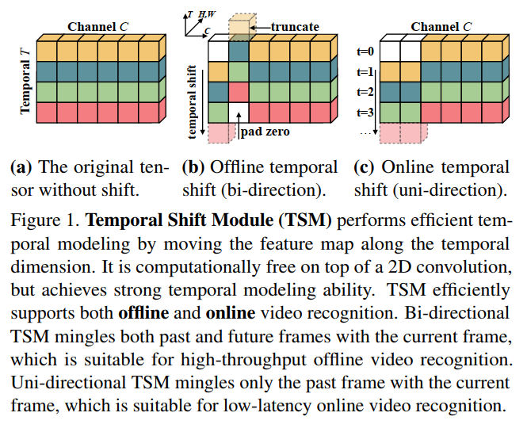
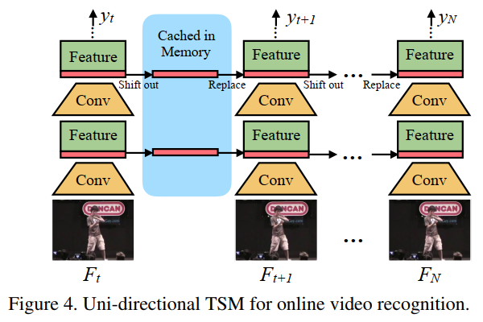

[TOC]

## 相关链接

https://github.com/mit-han-lab/temporal-shift-module

https://github.com/wang-xinyu/tensorrtx/tree/master/tsm

https://paddlepedia.readthedocs.io/en/latest/tutorials/computer_vision/video_understanding/TSM.html#id1

## 原理

提出了 时间移位模块






## 实现

TSM与TSN的唯一不同：是否带有TSM模块。

## 源码解析

https://github.com/mit-han-lab/temporal-shift-module


**数据增强：**随机裁剪、水平翻转、中心裁剪、多尺度图像裁剪

**输入：**$batch\_size * num\_segments * C * H * W$;

$batch\_size$是一批视频的数量;

$num\_segments$表示单个视频分割成$num\_segments$块，然后从$num\_segments$块中随机取一帧。

**输出：**$batch\_size$个labels

**损失函数：**CrossEntropyLoss

**优化器：**SGD

**学习率调整策略：**multistep


**代码修改：**

```
-ROOT_DATASET = '/ssd/video/'  # '/data/jilin/'
+# ROOT_DATASET = '/ssd/video/'  # '/data/jilin/'
+ROOT_DATASET = "/workdir/temporal-shift-module/"

-        correct_k = correct[:k].view(-1).float().sum(0)
+        # correct_k = correct[:k].view(-1).float().sum(0)
+        correct_k = correct[:k].reshape(-1).float().sum(0)
```


## 实验

### 动作识别

#### 数据集

- 9类动作
- 441段视频

```
# ls custom_dataset
images  labels
# ls custom_dataset/images/
0  1  2  3  4  5  6  7  8
# ls custom_dataset/labels/
train_videofolder.txt  val_videofolder.txt
# ls custom_dataset/images/0
00000-00_02_21-00_02_28  00001-00_07_00-00_07_08  00002-00_11_46-00_11_50
# ls custom_dataset/images/0/00000-00_02_21-00_02_28
img_00001.jpg  img_00020.jpg  img_00039.jpg  img_00058.jpg  img_00077.jpg
```


##### 视频转图像

```
# Code for "TSM: Temporal Shift Module for Efficient Video Understanding"
# arXiv:1811.08383
# Ji Lin*, Chuang Gan, Song Han
# {jilin, songhan}@mit.edu, ganchuang@csail.mit.edu

from __future__ import print_function, division
import os
import sys
import subprocess
from multiprocessing import Pool
from tqdm import tqdm

n_thread = 100


def vid2jpg(file_name, class_path, dst_class_path):
    if '.mp4' not in file_name:
        return
    name, ext = os.path.splitext(file_name)
    dst_directory_path = os.path.join(dst_class_path, name)

    video_file_path = os.path.join(class_path, file_name)
    try:
        if os.path.exists(dst_directory_path):
            if not os.path.exists(os.path.join(dst_directory_path, 'img_00001.jpg')):
                subprocess.call('rm -r \"{}\"'.format(dst_directory_path), shell=True)
                print('remove {}'.format(dst_directory_path))
                os.mkdir(dst_directory_path)
            else:
                print('*** convert has been done: {}'.format(dst_directory_path))
                return
        else:
            os.mkdir(dst_directory_path)
    except:
        print(dst_directory_path)
        return
    cmd = 'ffmpeg -i \"{}\" -threads 1 -vf scale=-1:331 -q:v 0 \"{}/img_%05d.jpg\"'.format(video_file_path, dst_directory_path)
    # print(cmd)
    subprocess.call(cmd, shell=True,
                    stdout=subprocess.DEVNULL, stderr=subprocess.DEVNULL)


def class_process(dir_path, dst_dir_path, class_name):
    print('*' * 20, class_name, '*'*20)
    class_path = os.path.join(dir_path, class_name)
    if not os.path.isdir(class_path):
        print('*** is not a dir {}'.format(class_path))
        return

    dst_class_path = os.path.join(dst_dir_path, class_name)
    if not os.path.exists(dst_class_path):
        # os.mkdir(dst_class_path)
        os.makedirs(dst_class_path)

    vid_list = os.listdir(class_path)
    vid_list.sort()
    p = Pool(n_thread)
    from functools import partial
    worker = partial(vid2jpg, class_path=class_path, dst_class_path=dst_class_path)
    for _ in tqdm(p.imap_unordered(worker, vid_list), total=len(vid_list)):
        pass
    # p.map(worker, vid_list)
    p.close()
    p.join()

    print('\n')


if __name__ == "__main__":
    # dir_path = sys.argv[1]
    # dst_dir_path = sys.argv[2]

    dir_path = "/workdir/datasets/video_classify/videos"
    dst_dir_path = "/workdir/datasets/video_classify/images"

    class_list = os.listdir(dir_path)
    class_list.sort()
    for class_name in class_list:
        class_process(dir_path, dst_dir_path, class_name)

    # class_name = 'test'
    # class_process(dir_path, dst_dir_path, class_name)
```


##### 生成标签文件

**train_videofolder.txt**

video frame path, video frame number, and video groundtruth class

```
/workdir/datasets/video_classify/images/0/00000-00_02_21-00_02_28 168 0
/workdir/datasets/video_classify/images/0/00000-00_03_31-00_03_36 143 0
/workdir/datasets/video_classify/images/0/00000-00_04_38-00_04_46 196 0
```


```
import os
import shutil

dataset_path = '/workdir/datasets/video_classify/images'
label_path = '/workdir/datasets/video_classify/labels'
filename_train_output = "train_videofolder.txt"
filename_val_output = 'val_videofolder.txt'

categories = os.listdir(dataset_path)
print("categories: {}".format(categories))

output = []

for class_idx in categories:
    class_path = os.path.join(dataset_path, class_idx)
    for folder in os.listdir(class_path):
        video_frame_path = os.path.join(class_path, folder)
        video_frame_number = len(os.listdir(video_frame_path))
        # video frame path, video frame number, and video groundtruth class
        output.append('%s %d %s'%(video_frame_path, video_frame_number, class_idx))
    
with open(os.path.join(label_path, filename_train_output),'w') as f:
    f.write('\n'.join(output))

shutil.copy(os.path.join(label_path, filename_train_output), os.path.join(label_path, filename_val_output))
```


#### 模型训练

```
# You should get TSM_kinetics_RGB_resnet50_shift8_blockres_avg_segment8_e50.pth
python main.py kinetics RGB \
     --arch resnet50 --num_segments 8 \
     --gd 20 --lr 0.02 --wd 1e-4 --lr_steps 20 40 --epochs 50 \
     --batch-size 8 -j 16 --dropout 0.5 --consensus_type=avg --eval-freq=1 \
     --shift --shift_div=8 --shift_place=blockres --npb \
     --gpus 0 \
     --workers 8 \
     --tune_from /workdir/temporal-shift-module/TSM_kinetics_RGB_resnet50_shift8_blockres_avg_segment8_e50.pth
```


```
python main.py kinetics RGB \
     --arch resnet50 --num_segments 16 \
     --gd 20 --lr 0.02 --wd 1e-4 --lr_steps 20 40 --epochs 50 \
     --batch-size 8 -j 16 --dropout 0.5 --consensus_type=avg --eval-freq=1 \
     --shift --shift_div=8 --shift_place=blockres --npb \
     --gpus 0 \
     --workers 8 \
     --tune_from /workdir/temporal-shift-module/TSM_kinetics_RGB_resnet50_shift8_blockres_avg_segment16_e50.pth
```


#### 训练结果

| 模型（微调）                                                 | top1 acc | top5 acc | 备注                             |
| ------------------------------------------------------------ | -------- | -------- | -------------------------------- |
| TSM_kinetics_RGB_resnet50_shift8_blockres_avg_segment8_e50.pth | 100.0    | 100.0    |                                  |
| TSM_kinetics_RGB_resnet50_shift8_blockres_avg_segment16_e50.pth | 93.651   | 99.320   | 可能是训练轮次不够导致准确率不高 |


#### 模型推断

16帧作为输入，步长为8帧。

==每隔6帧（0.2s）取一帧，得到16帧后，输入到模型进行预测。得到整个视频的动作类别结果后，设置一定的规则合并预测结果。==

推断时间：500ms左右

```
# Code for "TSM: Temporal Shift Module for Efficient Video Understanding"
# arXiv:1811.08383
# Ji Lin*, Chuang Gan, Song Han
# {jilin, songhan}@mit.edu, ganchuang@csail.mit.edu

import numpy as np
import os
from scipy.special import softmax
import time
import shutil
import torch.nn.parallel
import torch.backends.cudnn as cudnn
import torch.optim
from torch.nn.utils import clip_grad_norm_

from ops.dataset import TSNDataSet
from ops.models import TSN
from ops.transforms import *
from opts_custom import parser
from ops import dataset_config_custom
from ops.utils import AverageMeter, accuracy
from ops.temporal_shift import make_temporal_pool

from tensorboardX import SummaryWriter

best_prec1 = 0


def main():
    global args, best_prec1
    args = parser.parse_args()

    num_class, args.train_list, args.val_list, args.root_path, prefix = dataset_config_custom.return_dataset(args.dataset,
                                                                                                      args.modality)
    print("num_class: ", num_class)
    full_arch_name = args.arch
    if args.shift:
        full_arch_name += '_shift{}_{}'.format(args.shift_div, args.shift_place)
    if args.temporal_pool:
        full_arch_name += '_tpool'
    args.store_name = '_'.join(
        ['TSM', args.dataset, args.modality, full_arch_name, args.consensus_type, 'segment%d' % args.num_segments,
         'e{}'.format(args.epochs)])
    if args.pretrain != 'imagenet':
        args.store_name += '_{}'.format(args.pretrain)
    if args.lr_type != 'step':
        args.store_name += '_{}'.format(args.lr_type)
    if args.dense_sample:
        args.store_name += '_dense'
    if args.non_local > 0:
        args.store_name += '_nl'
    if args.suffix is not None:
        args.store_name += '_{}'.format(args.suffix)
    print('storing name: ' + args.store_name)

    model = TSN(num_class, args.num_segments, args.modality,
                base_model=args.arch,
                consensus_type=args.consensus_type,
                dropout=args.dropout,
                img_feature_dim=args.img_feature_dim,
                partial_bn=not args.no_partialbn,
                pretrain=args.pretrain,
                is_shift=args.shift, shift_div=args.shift_div, shift_place=args.shift_place,
                fc_lr5=not (args.tune_from and args.dataset in args.tune_from),
                temporal_pool=args.temporal_pool,
                non_local=args.non_local)

    crop_size = model.crop_size
    scale_size = model.scale_size
    input_mean = model.input_mean
    input_std = model.input_std

    model = torch.nn.DataParallel(model, device_ids=args.gpus).cuda()

    args.resume = "/workdir/temporal-shift-module/output/checkpoint/TSM_custom_dataset_RGB_resnet50_avg_segment8_e50/2021-07-24-09.41.20/ckpt.best.pth.tar"
    print(("=> loading checkpoint '{}'".format(args.resume)))
    checkpoint = torch.load(args.resume)
    model.load_state_dict(checkpoint['state_dict'])
    best_prec1 = checkpoint['best_prec1']
    print("best_prec1: ", best_prec1)

    if args.temporal_pool and not args.resume:
        make_temporal_pool(model.module.base_model, args.num_segments)

    cudnn.benchmark = True

    # Data loading code
    if args.modality != 'RGBDiff':
        normalize = GroupNormalize(input_mean, input_std)
    else:
        normalize = IdentityTransform()

    if args.modality == 'RGB':
        data_length = 1
    elif args.modality in ['Flow', 'RGBDiff']:
        data_length = 5

    # define loss function (criterion) and optimizer
    if args.loss_type == 'nll':
        criterion = torch.nn.CrossEntropyLoss().cuda()
    else:
        raise ValueError("Unknown loss type")

    args.evaluate = True

    # input
    video_path = '/workdir/datasets/video_classify/images/0/00005-00_06_40-00_06_48'
    # label 0
    indices = [ 18,  27,  60,  85, 115, 132, 172, 200]

    t = time.time()
    # load images
    image_tmpl = 'img_{:05d}.jpg'
    images = list()
    for seg_ind in indices:
        p = int(seg_ind)
        seg_imgs = [Image.open(os.path.join(video_path, image_tmpl.format(p))).convert('RGB')]
        images.extend(seg_imgs)
    # torch format tensor
    transform=torchvision.transforms.Compose([
                       GroupScale(int(scale_size)),
                       GroupCenterCrop(crop_size),
                       Stack(roll=(args.arch in ['BNInception', 'InceptionV3'])),
                       ToTorchFormatTensor(div=(args.arch not in ['BNInception', 'InceptionV3'])),
                       normalize,
                   ])

    process_data = transform(images).unsqueeze(dim=0)
    output = model(process_data.cuda())
    output = output.cpu().detach().numpy()
    output = softmax(output, axis=1)
    label = np.argmax(output, axis=1)
    print("output: ", output)
    print("label: ", label)
    t = time.time() - t
    print("time: {:.2f}".format(t * 1000))


if __name__ == '__main__':
    main()
```


